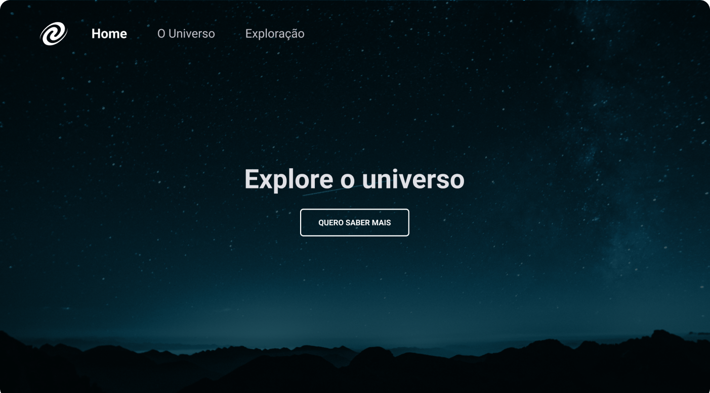

# SPA Universe

Projeto feito para praticar conceitos aprendidos em aulas do curso explorer da rocketseat.
 
Site responsivo.
 

### O que foi usado:
- Conceitos de SPA;  
- Mapeamento de rotas;  
- Assíncrono e promises;  
- Orientação a objetos;  
- Classes.

## Tecnologias
- HTML  
- CSS  
- JavaScript  
- Git

## Layout
Layout do projeto [aqui](<https://www.figma.com/file/m8zp3mtxvwyTGQs69nIFM8/%5BDesafios-Explorer%5D-SPA-Universe/duplicate?type=design&node-id=104-48&mode=design>).
 

  

